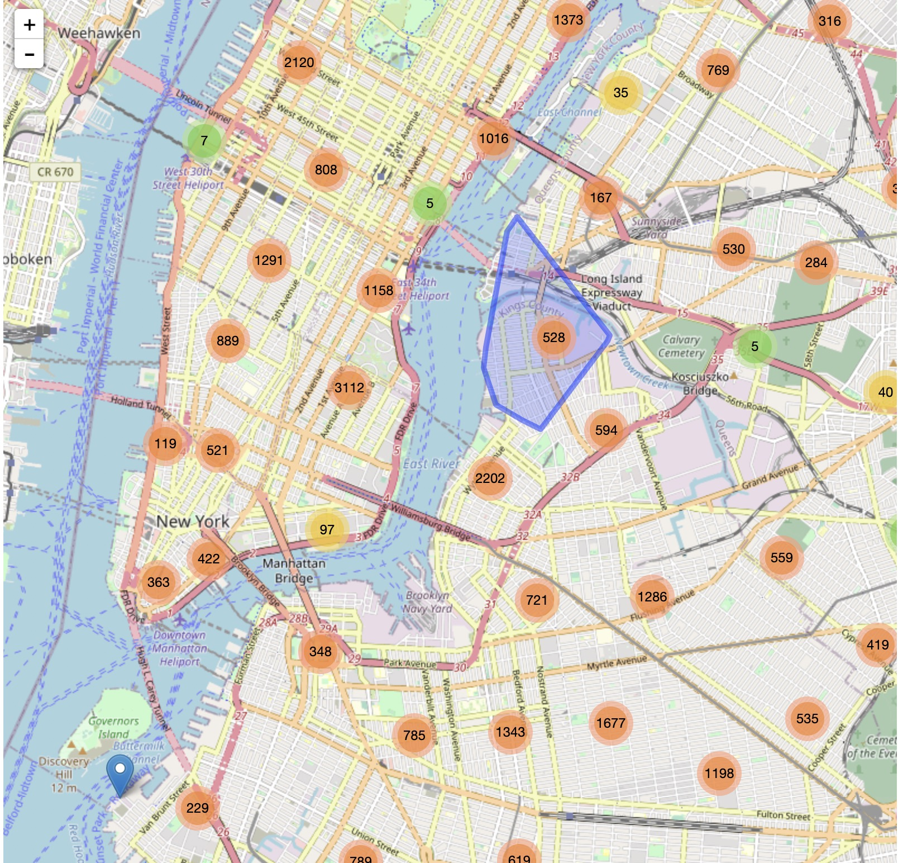

# Interactive component

Feel free to play around with our [interactive map of NYC](http://mappingnycgr5702.000webhostapp.com/){target="_blank"} !  

The interactive map of NYC is comprehensive and gives visitors a good sense of what Airbnb's offering in NYC. The map is friendly accessible: From the map, visitors can zoom in or out to select the region/neighborhood they would like to stay, then they can zoom in to see if any housing is available in that area. Next, they can click on the blue pinpoint and see some useful information, such as the room type, price per night and the rating for that housing. Those information we provided can help visitors better select their dream housing when they stay in NYC.  


Here we provide two pictures from the map to give you guys a better understanding of how the map works.  
From the first picture, we can see there is a bunch of red bubbles, and in each of them , there is a number. If we mouse on one bubble, you can see the related region/area represented by that bubble is plotted in blue lines.  
```{r, out.width = "60%", fig.align="center"}
#This is the graph of how many airbnb hosts we have in NYC.

```

If we zoom in the map, you can see the second picture we provided here. Bubbles disappear but pinpoints show up. Each pinpoint represents one Airbnb housing available in the region selected. Clicking on it, you will see some basic information about that housing, such as price per night, rating, which is a more efficient way for visitors to make comparisons and choose the one that has a great cost performance.  
```{r, out.width = "60%", fig.align="center"}
#In each host, we show the price, rate, bedroom type in graph, user can see it by click on pins.
knitr::include_graphics('data/WechatIMG181.jpeg'）
```
  
  


